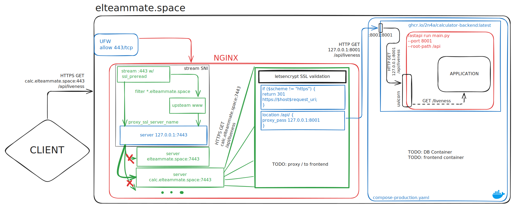

# Deployment

Для развертывания проекта достаточно смержить изменения в ветку
`main` (смотри [workflow](../.github/workflows/deploy.yml)).

Альтернативно, это можно сделать вручную:
```shell
cd deploy
ansible-playbook \
    -i "elteammate.space," \
    -u <username> \
    -e github-actor=<github-actor> \
    -e github-token=<github-token> \
    deploy-ansible-playbook.yaml
```

## Подводные камни

- `compose-production.yaml` содержет hardcoded-путь в GHCR,
  если имя нашей огранизации измениться, нужно будет поправить
- На сервере `compose.yaml` оказывается в `/opt/calculator/`
  (это настройка в `deploy-ansible-playbook.yaml`)
- Домен `elteammate.space` захардкожен в `nginx.conf`
- `nginx.conf` содержит путь к SSL-сертификатам от `elteammate.space`
- `nginx.conf` вообще сильно зависит от остальной инфраструктуры...
- Чтобы остановить сервер, нужно зайти на него через SSH и
  выполнить `docker compose -f /opt/calculator/compose.yaml down`

## Схема

